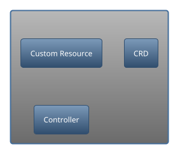
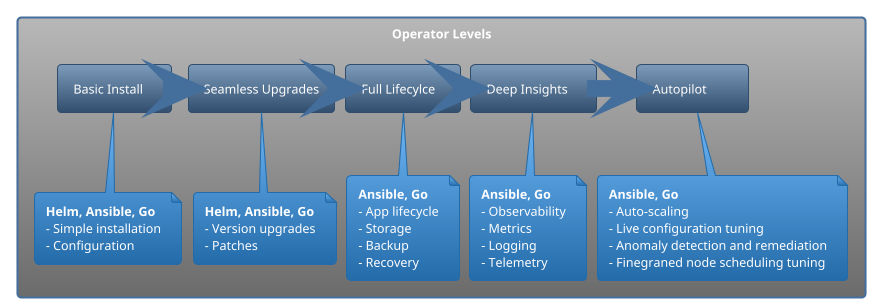

# Kubernetes Operators

The true power of Kubernetes is not the ability to orchestrate containers, but rather it's extensible API and [Control Plane](https://containerjournal.com/kubeconcnc/kubernetes-true-superpower-is-its-control-plane/). Kubernetes operators are at the core of this extensibility.

With containerization and container orchestration rapidly increasing

> According to the [Cloud Native Survey from 2020](https://www.cncf.io/blog/2020/11/17/cloud-native-survey-2020-containers-in-production-jump-300-from-our-first-survey/), the usage of containers in production jumped **300%**

The usage of tools like Kubernetes is only going to increase. There is a difference between using Kubernetes and being able to extend it.

Kubernetes is designed as a platform to build platforms and operators are the ultimate extensibility tools.

## Kubernetes Architecture

Before we dive start learning about operators, let's get a quick refresher on Kubernetes architecture:

```plantuml
@startuml k8s-architecture
'Icons
!include <kubernetes/k8s-sprites-labeled-25pct>
'Global Styles
!include https://raw.githubusercontent.com/Piotr1215/dca-prep-kit/master/diagrams/styles.iuml

rectangle "            <$master>\nKubernetes Architecture"

rectangle  "Control Plane" as ctrl {
    collections "<$etcd>" as etcd
    collections "<$sched>" as sched
    collections "<$api>" as api
    collections "<$c_m>" as cm
    collections "<$c_c_m>" as ccm
    api -> cm
    api .> ccm
    api -> sched
    api -> etcd
}

rectangle "Nodes" as nodes {
    node "Node" as node1 {
        component "<$kubelet>" as 1
        component "<$k_proxy>" as 2
        1 -[hidden]--> 2
    }
    node "Node" as node2 {
        component "<$kubelet>" as 3
        component "<$k_proxy>" as 4
        3 -[hidden]--> 4
    }
    node "Node" as node3 {
        component "<$kubelet>" as 5
        component "<$k_proxy>" as 6
        5 -[hidden]--> 6
    }
}

cloud "Cloud Provider\n API" as cloud

ctrl -[hidden]r-> nodes
ccm -> cloud

1 -> api
2 -> api
3 -> api
4 -> api
5 -> api
6 -> api

legend bottom
 |= Component |= Description |= Function  |
 |     <$etcd>  | Perisstent store | Key-value backing store for all \n cluster data |
 |     <$sched> | Scheduler | Watches for pods and assigns \n them to nodes |
 |     <$api>   | Kube API server | Exposes Kubernetes API,\n front end for control plane |
 |     <$c_m>   | Controller manager | Node Controller, Replication Controller, \n Endpoints Controller, \n Service Account & Token Controllers |
 |     <$c_c_m> | Cloud controller manager\n optional | Embeds cloud specific control logic |
 |     <$kubelet> | Kubelet | Responsible for runnning \n containers in a pod |
 |     <$k_proxy> | Kube proxy | Maintains network rules on nodes |
endlegend

@enduml
```

Internally Kubernetes architecture uses [controllers](https://kubernetes.io/docs/concepts/architecture/controller/) in closed **control loops** to ensure cluster health and correctness of the workloads by continuously reconciling **actual** state of the cluster with the **desired** state specified by the user/administrator.

Some of the controllers on the diagram are:

- controller manager which manages all the Kubernetes native control loops
- cloud controller which enables cloud providers to plug in their infrastructure elements

## Operator Pattern

Kubernetes operators follow the [operator pattern](https://kubernetes.io/docs/concepts/extend-kubernetes/operator/). In simple terms operator pattern automates operations performed typically by humans, such as:

- installation
- updates and upgrades
- configuration
- backup
- gathering metrics
- troubleshooting

### Controller vs operator

What is the difference between controllers and operators? Well, there is no technical difference, but rather in semantics.

> Controller is a control loop continuously watching and reconciling state of the cluster. Operator is also a controller, but it additionally encapsulates specific domain knowledge.

- helm vs operator
- 5 levels on operator maturity
- Operatorhub.io

### Operator component architecture



### Operator maturity levels



### When to use operators

Should you start writing operators for everything? Obviously no, so when should you? Here are a few good use cases for operators

TODO: Operator use cases

## Demo scenario

### Prerequisites

This is a self-contained development environment where you can play around with creating an operator using kubebuilder and Go.

Alternatively, you can try and excellent [Katacoda scenario](https://www.katacoda.com/javajon/courses/kubernetes-extensibility/kubebuilder) by [@javajon](https://github.com/javajon)

If you decided to use this repository, there are a few prerequisites:

- VS Code with [Remote Development Extensions](https://marketplace.visualstudio.com/items?itemName=ms-vscode-remote.vscode-remote-extensionpack)
- Docker Desktop with Kubernetes enabled. If you have other Kubernetes clusters in your config file, make sure to point to docker-desktop

> I've tested it with remote cluster and it works too, but doesn't work with k3s/k3d.

The image will take a while to load as it pulls kubebuilder, Go binaries and other components, so please patient :watch:

## Resources

- [Kubernetes docs operator pattern](https://kubernetes.io/docs/concepts/extend-kubernetes/operator/)
- [CNCF Operators White Paper](https://github.com/cncf/tag-app-delivery/blob/master/operator-wg/whitepaper/Operator-WhitePaper_v1-0.md#)
- [CNCF Blog controller for pod labels](https://kubernetes.io/blog/2021/06/21/writing-a-controller-for-pod-labels/)
- [Great video](https://www.youtube.com/watch?v=08O9eLJGQRM&ab_channel=CloudNativeSkunkworks) explaining operators
- [Build a Kubernetes operator RedHat](https://developers.redhat.com/articles/2021/09/07/build-kubernetes-operator-six-steps?sc_cid=7013a000002pkdsAAA#)
- [Intro to operators RedHat](https://developers.redhat.com/articles/2021/06/11/kubernetes-operators-101-part-1-overview-and-key-features#operators_extend_kubernetes_to_automate_tasks)
- [Intro to operators IBM](https://developer.ibm.com/articles/how-operators-extend-kubernetes-functionality/)
- [Medium build operator with Go](https://betterprogramming.pub/building-a-highly-available-kubernetes-operator-using-golang-fe4a44c395c2)
- [Medium Kubernetes operator by example](https://codeburst.io/kubernetes-operators-by-example-99a77ea4ac43)
- [Git Awesome operator frameworks](https://github.com/pperzyna/awesome-operator-frameworks)
- [TGIK 040: Kubebuilder](https://www.youtube.com/watch?v=N-lTSk1bGAg&t=3299s&ab_channel=Heptio)
