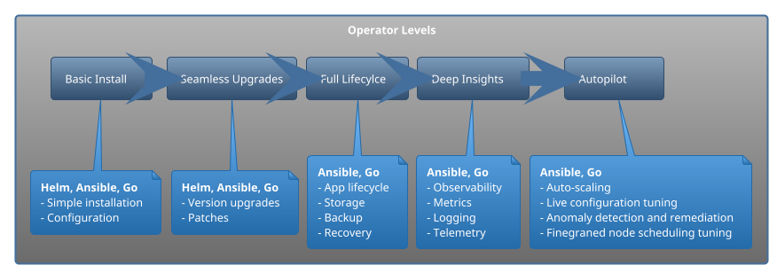

# Writing a Kubernetes operator

## Prerequisites

This is a self-contained development environment where you can play around with creating an operator using kubebuilder and Go.

Alternativelly, you can try and excellent [Katacoda scenario](https://www.katacoda.com/javajon/courses/kubernetes-extensibility/kubebuilder) by [@javajon](https://github.com/javajon)

If you decided to use this repository, there are a few prerequisites:

- VS Code with [Remote Development Extensions](https://marketplace.visualstudio.com/items?itemName=ms-vscode-remote.vscode-remote-extensionpack)
- Docker Desktop with Kubernetes enabled. If you have other kubernetes clusters in your config file, make sure to point to docker-desktop

> I've tested it with remote cluster and it works too, but doesn't work with k3s/k3d.

The image will take a while to load as it pulls kubebuilder, Go binaries and other components, so please patient :watch:

## Expand on those

- operator pattern
- controller vs operator
- helm vs operator
- 5 levels on operator maturity
- Operatorhub.io

## Operator component architecture

## Resources

- [Kuberneted docs opetator pattern](https://kubernetes.io/docs/concepts/extend-kubernetes/operator/)
- [CNCF Opetarots WhitePaper](https://github.com/cncf/tag-app-delivery/blob/master/operator-wg/whitepaper/Operator-WhitePaper_v1-0.md#)
- [CNCF Blog controller for pod labels](https://kubernetes.io/blog/2021/06/21/writing-a-controller-for-pod-labels/)
- [Great video](https://www.youtube.com/watch?v=08O9eLJGQRM&ab_channel=CloudNativeSkunkworks) explaining operators
- [Build a kubernetes operator RedHat](https://developers.redhat.com/articles/2021/09/07/build-kubernetes-operator-six-steps?sc_cid=7013a000002pkdsAAA#)
- [Intro to opetators RedHat](https://developers.redhat.com/articles/2021/06/11/kubernetes-operators-101-part-1-overview-and-key-features#operators_extend_kubernetes_to_automate_tasks)
- [Intro to opetators IBM](https://developer.ibm.com/articles/how-operators-extend-kubernetes-functionality/)
- [Medium build operator with Go](https://betterprogramming.pub/building-a-highly-available-kubernetes-operator-using-golang-fe4a44c395c2)
- [Medium Kubernetes operator by example](https://codeburst.io/kubernetes-operators-by-example-99a77ea4ac43)
- [Git Awesome opetator frameworks](https://github.com/pperzyna/awesome-operator-frameworks)
- [TGIK 040: Kubebuilder](https://www.youtube.com/watch?v=N-lTSk1bGAg&t=3299s&ab_channel=Heptio)
