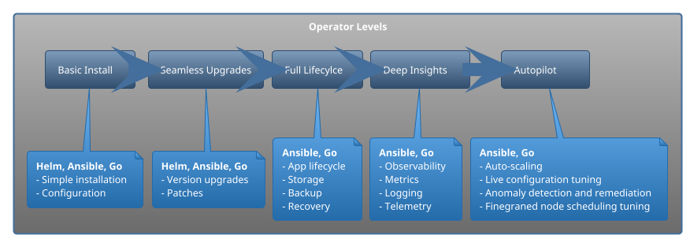

# Kubernetes Operators

The true power of Kubernetes is not the ability to orchestrate containers, but rather it's extensible API and [Control Plane](https://containerjournal.com/kubeconcnc/kubernetes-true-superpower-is-its-control-plane/). Kubernetes operators are at the core of this extensibility.

With containerization and container orchestration rapidly increasing

> According to the [Cloud Native Survey from 2020](https://www.cncf.io/blog/2020/11/17/cloud-native-survey-2020-containers-in-production-jump-300-from-our-first-survey/), the usage of containers in production jumped **300%**

The usage of tools like Kubernetes is only going to increase. There is a difference between using Kubernetes and being able to extend it.

Kubernetes is designed as a platform to build platforms and operators are the ultimate extensibility tools.

In this article we will look at operator pattern, learn when it is appropriate to use an operator. Finally we will explore operator's component architecture.

## Kubernetes Architecture

Before we start learning about operators, let's get a quick refresher on Kubernetes architecture:

<small>Kubernetes Architecture</small>

Internally Kubernetes architecture uses [controllers](https://kubernetes.io/docs/concepts/architecture/controller/) in closed **control loops** to ensure cluster health and correctness of the workloads by continuously reconciling **actual** state of the cluster with the **desired** state specified by the user/administrator.

Some of the controllers on the diagram are:

- controller manager which manages all the Kubernetes native control loops
- cloud controller which enables cloud providers to plug in their infrastructure elements

## Operators Overview

Kubernetes operators follow the [operator pattern](https://kubernetes.io/docs/concepts/extend-kubernetes/operator/). In simple terms operator pattern automates operations performed typically by humans, such as:

- installation
- updates and upgrades
- configuration
- backup
- gathering metrics
- troubleshooting

### Architecture

### Maturity levels

Operators can be as simple as installing components onto a cluster up to much more complex, like full life cycle management or even performance of configuration fine tuning live as the application runs.

There are 5 levels of operator maturity:

## Operators in practice

Should you start writing operators for everything? Obviously no, so when should you? Here are a few good use cases for operators

- updating/upgrading stateful workloads
- interacting with external resources outside of a Kubernetes cluster
- chaos engineering
- advanced scheduling, configuration and failure resiliency

Writing and maintaining an operator is a very complex process, you need:
- deep understanding of Kubernetes internals
- expertise in any programming language (preferably Go)
- strong grasp on concepts like "eventual consistency", "loose coupling", "event driven architecture"

> Before looking into creating your own operator, make sure to visit [operator hub](operatorhub.io). There is a chance that the software you are using already has an operator.

### Controller vs operator

What is the difference between controllers and operators? Well, there is no technical difference, but rather in semantics.

> Controller is a control loop continuously watching and reconciling state of the cluster. Operator is also a controller, but it additionally encapsulates specific domain knowledge.

### Helm vs operator

If you look closer at what an operator is doing, it looks a lot like [helm](https://helm.sh/), at least from packaging point of view. 

> Whenever a question comes to "A vs B", it is usually a good heuristics to rephrase it into "When is it more appropriate to use A and when B"

Similarly here, helm is great for simple installation and templating, but operator can do custom logic on the resources which helm simply was not designed for.

## Tooling

There is a lot of operator frameworks, SDKs and related tooling, but I recommend looking at **[kubebuilder](https://github.com/kubernetes-sigs/kubebuilder)**, also available in the form of an [online book](https://book.kubebuilder.io/).

> Please refer to the last section of this blog "Resources" where you can find more information about available tools.

### Demo scenarios

There are a few choices if you would like to experiment with operators. I recommend going thorough [kubebuilder's quickstart](https://book.kubebuilder.io/quick-start.html).

- use [my repository](https://github.com/Piotr1215/kubernetes-oparators) with a self-contained development environment if you have already a Kubernetes cluster and you would like to try something locally on your machine. Please note that this is a containerized environment, so other than Kubernetes and VS Code, you don't need anything else.

- follow an excellent [Katacoda scenario](https://www.katacoda.com/javajon/courses/kubernetes-extensibility/kubebuilder) by [@javajon](https://github.com/javajon) if you don't want to install anything on your local machine and would rather prefer remote infrastructure.

If you decided to use this repository, there are a few prerequisites:

- VS Code with [Remote Development Extensions](https://marketplace.visualstudio.com/items?itemName=ms-vscode-remote.vscode-remote-extensionpack)
- Docker Desktop with Kubernetes enabled. If you have other Kubernetes clusters in your config file, make sure to point to docker-desktop

> I've tested it with remote cluster and it works too, but doesn't work with k3s/k3d.

The image will take a while to load as it pulls kubebuilder, Go binaries and other components, so please patient :watch:

## Summary

Kubernetes operators are difficult, take time to master and create maintenance challenges. However, if you find a good use case and can commit time and resources to master them, it will unlock additional powerful Kubernetes capabilities.

## Resources

- [Kubernetes docs operator pattern](https://kubernetes.io/docs/concepts/extend-kubernetes/operator/)
- [CNCF Operators White Paper](https://github.com/cncf/tag-app-delivery/blob/master/operator-wg/whitepaper/Operator-WhitePaper_v1-0.md#)
- [CNCF Blog controller for pod labels](https://kubernetes.io/blog/2021/06/21/writing-a-controller-for-pod-labels/)
- [Video with hands on operator building](https://www.youtube.com/watch?v=08O9eLJGQRM&ab_channel=CloudNativeSkunkworks)
- [Build a Kubernetes operator RedHat](https://developers.redhat.com/articles/2021/09/07/build-kubernetes-operator-six-steps?sc_cid=7013a000002pkdsAAA#)
- [Intro to operators RedHat](https://developers.redhat.com/articles/2021/06/11/kubernetes-operators-101-part-1-overview-and-key-features#operators_extend_kubernetes_to_automate_tasks)
- [Intro to operators IBM](https://developer.ibm.com/articles/how-operators-extend-kubernetes-functionality/)
- [Medium build operator with Go](https://betterprogramming.pub/building-a-highly-available-kubernetes-operator-using-golang-fe4a44c395c2)
- [Medium Kubernetes operator by example](https://codeburst.io/kubernetes-operators-by-example-99a77ea4ac43)
- [Git Awesome operator frameworks](https://github.com/pperzyna/awesome-operator-frameworks)
- [TGIK 040: Kubebuilder](https://www.youtube.com/watch?v=N-lTSk1bGAg&t=3299s&ab_channel=Heptio)
